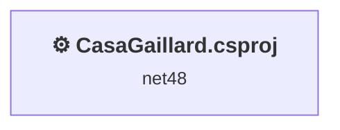
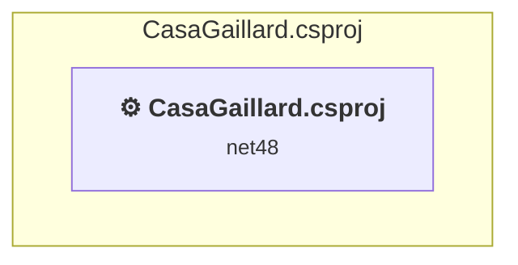

# Projects and dependencies analysis

This document provides a comprehensive overview of the projects and their dependencies in the context of upgrading to .NETCoreApp,Version=v10.0.

## Table of Contents

- [Executive Summary](#executive-Summary)
  - [Highlevel Metrics](#highlevel-metrics)
  - [Projects Compatibility](#projects-compatibility)
  - [Package Compatibility](#package-compatibility)
  - [API Compatibility](#api-compatibility)
  - [Binding Redirect Configuration](#binding-redirect-configuration)
- [Aggregate NuGet packages details](#aggregate-nuget-packages-details)
- [Top API Migration Challenges](#top-api-migration-challenges)
  - [Technologies and Features](#technologies-and-features)
  - [Most Frequent API Issues](#most-frequent-api-issues)
- [Projects Relationship Graph](#projects-relationship-graph)
- [Project Details](#project-details)

  - [CasaGaillard.csproj](#casagaillardcsproj)

## Executive Summary

### Highlevel Metrics

| Metric | Count | Status |
| :--- | :---: | :--- |
| Total Projects | 1 | All require upgrade |
| Total NuGet Packages | 47 | 24 need upgrade |
| Total Code Files | 276 |  |
| Total Code Files with Incidents | 76 |  |
| Total Lines of Code | 19689 |  |
| Total Number of Issues | 3723 |  |
| Estimated LOC to modify | 3630+ | at least 18,4% of codebase |

### Projects Compatibility

| Project | Target Framework | Difficulty | Package Issues | API Issues | Binding Issues | Est. LOC Impact | Description |
| :--- | :---: | :---: | :---: | :---: | :---: | :---: | :--- |
| [CasaGaillard.csproj](#casagaillardcsproj) | net48 | 🔴 High | 34 | 3630 | 21 | 3630+ | Wap, Sdk Style = False |

### Package Compatibility

| Status | Count | Percentage |
| :--- | :---: | :---: |
| ✅ Compatible | 23 | 48,9% |
| ⚠️ Incompatible | 23 | 48,9% |
| 🔄 Upgrade Recommended | 1 | 2,1% |
| ***Total NuGet Packages*** | ***47*** | ***100%*** |

### API Compatibility

| Category | Count | Impact |
| :--- | :---: | :--- |
| 🔴 Binary Incompatible | 3470 | High - Require code changes |
| 🟡 Source Incompatible | 159 | Medium - Needs re-compilation and potential conflicting API error fixing |
| 🔵 Behavioral change | 1 | Low - Behavioral changes that may require testing at runtime |
| ✅ Compatible | 15757 |  |
| ***Total APIs Analyzed*** | ***19387*** |  |

### Binding Redirect Configuration

| Severity | Count | Description |
| :--- | :---: | :--- |
| 🔴Mandatory | 2 | Must be fixed to avoid runtime failures |
| 🟡Potential | 19 | May cause issues in certain scenarios |
| ***Total Binding Issues*** | ***21*** | ***Across 1 project(s)*** |

## Aggregate NuGet packages details

| Package | Current Version | Suggested Version | Projects | Description |
| :--- | :---: | :---: | :--- | :--- |
| Antlr | 3.5.0.2 |  | [CasaGaillard.csproj](#casagaillardcsproj) | Needs to be replaced with Replace with new package Antlr4=4.6.6 |
| bootstrap | 5.3.8 |  | [CasaGaillard.csproj](#casagaillardcsproj) | ✅Compatible |
| cldrjs | 0.5.1 |  | [CasaGaillard.csproj](#casagaillardcsproj) | ✅Compatible |
| EntityFramework | 6.5.2 |  | [CasaGaillard.csproj](#casagaillardcsproj) | ✅Compatible |
| FontAwesomeIcons | 1.0.3 |  | [CasaGaillard.csproj](#casagaillardcsproj) | ✅Compatible |
| jQuery | 3.6.3 |  | [CasaGaillard.csproj](#casagaillardcsproj) | ✅Compatible |
| jQuery.Validation | 1.19.5 |  | [CasaGaillard.csproj](#casagaillardcsproj) | ✅Compatible |
| jquery-globalize | 1.4.2 |  | [CasaGaillard.csproj](#casagaillardcsproj) | ✅Compatible |
| Microsoft.AspNet.Identity.Core | 2.2.4 |  | [CasaGaillard.csproj](#casagaillardcsproj) | ⚠️El paquete NuGet no es compatible |
| Microsoft.AspNet.Identity.Core.es | 2.2.4 |  | [CasaGaillard.csproj](#casagaillardcsproj) | ⚠️El paquete NuGet no es compatible |
| Microsoft.AspNet.Identity.EntityFramework | 2.2.4 |  | [CasaGaillard.csproj](#casagaillardcsproj) | ⚠️El paquete NuGet no es compatible |
| Microsoft.AspNet.Identity.Owin | 2.2.4 |  | [CasaGaillard.csproj](#casagaillardcsproj) | ⚠️El paquete NuGet no es compatible |
| Microsoft.AspNet.Identity.Owin.es | 2.2.4 |  | [CasaGaillard.csproj](#casagaillardcsproj) | ⚠️El paquete NuGet no es compatible |
| Microsoft.AspNet.Mvc | 5.2.9 |  | [CasaGaillard.csproj](#casagaillardcsproj) | La funcionalidad del paquete NuGet se incluye con la referencia del marco |
| Microsoft.AspNet.Mvc.es | 5.2.9 |  | [CasaGaillard.csproj](#casagaillardcsproj) | ⚠️El paquete NuGet no es compatible |
| Microsoft.AspNet.Razor | 3.2.9 |  | [CasaGaillard.csproj](#casagaillardcsproj) | La funcionalidad del paquete NuGet se incluye con la referencia del marco |
| Microsoft.AspNet.Razor.es | 3.2.9 |  | [CasaGaillard.csproj](#casagaillardcsproj) | ⚠️El paquete NuGet no es compatible |
| Microsoft.AspNet.Web.Optimization | 1.1.3 |  | [CasaGaillard.csproj](#casagaillardcsproj) | ⚠️El paquete NuGet no es compatible |
| Microsoft.AspNet.Web.Optimization.es | 1.1.3 |  | [CasaGaillard.csproj](#casagaillardcsproj) | ⚠️El paquete NuGet no es compatible |
| Microsoft.AspNet.WebApi.Client | 5.2.9 |  | [CasaGaillard.csproj](#casagaillardcsproj) | ✅Compatible |
| Microsoft.AspNet.WebPages | 3.2.9 |  | [CasaGaillard.csproj](#casagaillardcsproj) | La funcionalidad del paquete NuGet se incluye con la referencia del marco |
| Microsoft.AspNet.WebPages.es | 3.2.9 |  | [CasaGaillard.csproj](#casagaillardcsproj) | ⚠️El paquete NuGet no es compatible |
| Microsoft.CodeDom.Providers.DotNetCompilerPlatform | 3.6.0 |  | [CasaGaillard.csproj](#casagaillardcsproj) | La funcionalidad del paquete NuGet se incluye con la referencia del marco |
| Microsoft.CSharp | 4.7.0 |  | [CasaGaillard.csproj](#casagaillardcsproj) | ✅Compatible |
| Microsoft.jQuery.Unobtrusive.Validation | 4.0.0 |  | [CasaGaillard.csproj](#casagaillardcsproj) | ✅Compatible |
| Microsoft.Owin | 4.2.2 |  | [CasaGaillard.csproj](#casagaillardcsproj) | ⚠️El paquete NuGet no es compatible |
| Microsoft.Owin.Host.SystemWeb | 4.2.2 |  | [CasaGaillard.csproj](#casagaillardcsproj) | ⚠️El paquete NuGet no es compatible |
| Microsoft.Owin.Security | 4.2.2 |  | [CasaGaillard.csproj](#casagaillardcsproj) | ⚠️El paquete NuGet no es compatible |
| Microsoft.Owin.Security.Cookies | 4.2.2 |  | [CasaGaillard.csproj](#casagaillardcsproj) | ⚠️Replace with Microsoft.AspNetCore.Authentication.Cookies: Use AddAuthentication().AddCookie() in Startup; adjust cookie options |
| Microsoft.Owin.Security.Facebook | 4.2.2 |  | [CasaGaillard.csproj](#casagaillardcsproj) | ⚠️El paquete NuGet no es compatible |
| Microsoft.Owin.Security.Google | 4.2.2 |  | [CasaGaillard.csproj](#casagaillardcsproj) | ⚠️El paquete NuGet no es compatible |
| Microsoft.Owin.Security.MicrosoftAccount | 4.2.2 |  | [CasaGaillard.csproj](#casagaillardcsproj) | ⚠️El paquete NuGet no es compatible |
| Microsoft.Owin.Security.OAuth | 4.2.2 |  | [CasaGaillard.csproj](#casagaillardcsproj) | ⚠️Replace with Microsoft.AspNetCore.Authentication.JwtBearer: Use JWT Bearer for token validation; adopt IdentityServer or Azure AD for issuing tokens |
| Microsoft.Owin.Security.Twitter | 4.2.2 |  | [CasaGaillard.csproj](#casagaillardcsproj) | ⚠️El paquete NuGet no es compatible |
| Microsoft.Web.Infrastructure | 2.0.0 |  | [CasaGaillard.csproj](#casagaillardcsproj) | La funcionalidad del paquete NuGet se incluye con la referencia del marco |
| Modernizr | 2.8.3 |  | [CasaGaillard.csproj](#casagaillardcsproj) | ✅Compatible |
| Newtonsoft.Json | 13.0.2 | 13.0.4 | [CasaGaillard.csproj](#casagaillardcsproj) | Se recomienda actualizar el paquete NuGet |
| Newtonsoft.Json.Bson | 1.0.2 |  | [CasaGaillard.csproj](#casagaillardcsproj) | ✅Compatible |
| Owin | 1.0 |  | [CasaGaillard.csproj](#casagaillardcsproj) | ⚠️El paquete NuGet no es compatible |
| PagedList | 1.17.0.0 |  | [CasaGaillard.csproj](#casagaillardcsproj) | ⚠️El paquete NuGet no es compatible |
| PagedList.Mvc | 4.5.0.0 |  | [CasaGaillard.csproj](#casagaillardcsproj) | ⚠️El paquete NuGet no es compatible |
| popper.js | 1.16.1 |  | [CasaGaillard.csproj](#casagaillardcsproj) | ✅Compatible |
| System.ComponentModel.Annotations | 5.0.0 |  | [CasaGaillard.csproj](#casagaillardcsproj) | La funcionalidad del paquete NuGet se incluye con la referencia del marco |
| System.Runtime.InteropServices.RuntimeInformation | 4.3.0 |  | [CasaGaillard.csproj](#casagaillardcsproj) | La funcionalidad del paquete NuGet se incluye con la referencia del marco |
| System.ValueTuple | 4.5.0 |  | [CasaGaillard.csproj](#casagaillardcsproj) | La funcionalidad del paquete NuGet se incluye con la referencia del marco |
| WebActivatorEx | 2.2.0 |  | [CasaGaillard.csproj](#casagaillardcsproj) | ⚠️El paquete NuGet no es compatible |
| WebGrease | 1.6.0 |  | [CasaGaillard.csproj](#casagaillardcsproj) | ✅Compatible |

## Top API Migration Challenges

### Technologies and Features

| Technology | Issues | Percentage | Migration Path |
| :--- | :---: | :---: | :--- |
| ASP.NET Framework (System.Web) | 3386 | 93,3% | Legacy ASP.NET Framework APIs for web applications (System.Web.*) that don't exist in ASP.NET Core due to architectural differences. ASP.NET Core represents a complete redesign of the web framework. Migrate to ASP.NET Core equivalents or consider System.Web.Adapters package for compatibility. |
| Legacy Configuration System | 18 | 0,5% | Legacy XML-based configuration system (app.config/web.config) that has been replaced by a more flexible configuration model in .NET Core. The old system was rigid and XML-based. Migrate to Microsoft.Extensions.Configuration with JSON/environment variables; use System.Configuration.ConfigurationManager NuGet package as interim bridge if needed. |

### Most Frequent API Issues

| API | Count | Percentage | Category |
| :--- | :---: | :---: | :--- |
| T:System.Web.Mvc.SelectListItem | 228 | 6,3% | Binary Incompatible |
| T:System.Web.Mvc.ActionResult | 220 | 6,1% | Binary Incompatible |
| T:System.Web.Mvc.ViewResult | 183 | 5,0% | Binary Incompatible |
| M:System.Web.Mvc.Controller.View(System.Object) | 132 | 3,6% | Binary Incompatible |
| T:System.Web.Mvc.ModelStateDictionary | 124 | 3,4% | Binary Incompatible |
| P:System.Web.Mvc.Controller.ModelState | 122 | 3,4% | Binary Incompatible |
| M:System.Web.Mvc.AuthorizeAttribute.#ctor | 120 | 3,3% | Binary Incompatible |
| T:System.Web.Mvc.AuthorizeAttribute | 120 | 3,3% | Binary Incompatible |
| T:System.Web.Mvc.RedirectToRouteResult | 116 | 3,2% | Binary Incompatible |
| T:System.Web.Mvc.HttpNotFoundResult | 103 | 2,8% | Binary Incompatible |
| M:System.Web.Mvc.Controller.HttpNotFound | 103 | 2,8% | Binary Incompatible |
| P:System.Web.Mvc.ControllerBase.ViewBag | 99 | 2,7% | Binary Incompatible |
| M:System.Web.Mvc.ValidateAntiForgeryTokenAttribute.#ctor | 95 | 2,6% | Binary Incompatible |
| T:System.Web.Mvc.ValidateAntiForgeryTokenAttribute | 95 | 2,6% | Binary Incompatible |
| M:System.Web.Mvc.HttpPostAttribute.#ctor | 95 | 2,6% | Binary Incompatible |
| T:System.Web.Mvc.HttpPostAttribute | 95 | 2,6% | Binary Incompatible |
| M:System.Web.Mvc.ModelStateDictionary.AddModelError(System.String,System.String) | 69 | 1,9% | Binary Incompatible |
| T:System.Web.Mvc.SelectList | 56 | 1,5% | Binary Incompatible |
| M:System.Web.Mvc.Controller.RedirectToAction(System.String,System.Object) | 54 | 1,5% | Binary Incompatible |
| P:System.Web.Mvc.ModelStateDictionary.IsValid | 51 | 1,4% | Binary Incompatible |
| T:System.Web.Mvc.TempDataDictionary | 51 | 1,4% | Binary Incompatible |
| P:System.Web.Mvc.ControllerBase.TempData | 51 | 1,4% | Binary Incompatible |
| P:System.Web.Mvc.TempDataDictionary.Item(System.String) | 51 | 1,4% | Binary Incompatible |
| M:System.Web.Mvc.Controller.RedirectToAction(System.String) | 50 | 1,4% | Binary Incompatible |
| T:System.Web.Mvc.HttpStatusCodeResult | 47 | 1,3% | Binary Incompatible |
| M:System.Web.Mvc.SelectList.#ctor(System.Collections.IEnumerable,System.String,System.String,System.Object) | 46 | 1,3% | Binary Incompatible |
| M:System.Web.Mvc.HttpStatusCodeResult.#ctor(System.Net.HttpStatusCode) | 33 | 0,9% | Binary Incompatible |
| M:System.Web.Mvc.Controller.#ctor | 31 | 0,9% | Binary Incompatible |
| P:System.Web.Mvc.SelectListItem.Value | 31 | 0,9% | Binary Incompatible |
| P:System.Web.Mvc.Controller.User | 30 | 0,8% | Binary Incompatible |
| P:System.Web.Mvc.SelectListItem.Text | 30 | 0,8% | Binary Incompatible |
| M:System.Web.Mvc.SelectListItem.#ctor | 30 | 0,8% | Binary Incompatible |
| T:System.Web.Mvc.Controller | 25 | 0,7% | Binary Incompatible |
| T:Microsoft.AspNet.Identity.IdentityExtensions | 24 | 0,7% | Binary Incompatible |
| M:Microsoft.AspNet.Identity.IdentityExtensions.GetUserId(System.Security.Principal.IIdentity) | 24 | 0,7% | Binary Incompatible |
| P:System.Web.Mvc.SelectListItem.Selected | 24 | 0,7% | Binary Incompatible |
| M:System.Web.Mvc.Controller.Dispose(System.Boolean) | 23 | 0,6% | Binary Incompatible |
| M:System.Web.Mvc.Controller.View | 22 | 0,6% | Binary Incompatible |
| T:Microsoft.AspNet.Identity.Owin.SignInStatus | 22 | 0,6% | Binary Incompatible |
| M:System.Web.Mvc.AllowAnonymousAttribute.#ctor | 21 | 0,6% | Binary Incompatible |
| T:System.Web.Mvc.AllowAnonymousAttribute | 21 | 0,6% | Binary Incompatible |
| T:System.Web.HttpPostedFileBase | 19 | 0,5% | Source Incompatible |
| M:System.Web.Mvc.BindAttribute.#ctor | 17 | 0,5% | Binary Incompatible |
| T:System.Web.Mvc.BindAttribute | 17 | 0,5% | Binary Incompatible |
| M:System.Web.Mvc.Controller.View(System.String,System.Object) | 15 | 0,4% | Binary Incompatible |
| M:System.Web.Mvc.Controller.View(System.String) | 14 | 0,4% | Binary Incompatible |
| M:System.Web.Mvc.HttpStatusCodeResult.#ctor(System.Int32) | 14 | 0,4% | Binary Incompatible |
| T:System.Web.Mvc.JsonResult | 14 | 0,4% | Binary Incompatible |
| T:System.Web.HttpServerUtilityBase | 13 | 0,4% | Source Incompatible |
| P:System.Web.Mvc.Controller.Server | 13 | 0,4% | Binary Incompatible |

## Projects Relationship Graph

Legend:
📦 SDK-style project
⚙️ Classic project

## Project Details

### CasaGaillard.csproj

#### Project Info

- **Current Target Framework:** net48
- **Proposed Target Framework:** net10.0
- **SDK-style**: False
- **Project Kind:** Wap
- **Dependencies**: 0
- **Dependants**: 0
- **Number of Files**: 666
- **Number of Files with Incidents**: 76
- **Lines of Code**: 19689
- **Estimated LOC to modify**: 3630+ (at least 18,4% of the project)

#### Dependency Graph

Legend:
📦 SDK-style project
⚙️ Classic project

### API Compatibility

| Category | Count | Impact |
| :--- | :---: | :--- |
| 🔴 Binary Incompatible | 3470 | High - Require code changes |
| 🟡 Source Incompatible | 159 | Medium - Needs re-compilation and potential conflicting API error fixing |
| 🔵 Behavioral change | 1 | Low - Behavioral changes that may require testing at runtime |
| ✅ Compatible | 15757 |  |
| ***Total APIs Analyzed*** | ***19387*** |  |

#### Binding Redirect Configuration

| Rule | Severity | Details | Recommendation |
| :--- | :---: | :--- | :--- |
| Missing binding redirect for referenced assembly | 🟡Potential | Manual redirects exist but none covers EntityFramework (referenced v6.0.0.0, package v6.5.2) | Add a binding redirect for the missing assembly. |
| Missing binding redirect for referenced assembly | 🟡Potential | Manual redirects exist but none covers FontAwesomeIcons (referenced v1.0.3.0, package v1.0.3) | Add a binding redirect for the missing assembly. |
| Missing binding redirect for referenced assembly | 🟡Potential | Manual redirects exist but none covers Microsoft.AspNet.Identity.Core (referenced v2.0.0.0, package v2.2.4) | Add a binding redirect for the missing assembly. |
| Missing binding redirect for referenced assembly | 🟡Potential | Manual redirects exist but none covers Microsoft.AspNet.Identity.EntityFramework (referenced v2.0.0.0, package v2.2.4) | Add a binding redirect for the missing assembly. |
| Missing binding redirect for referenced assembly | 🟡Potential | Manual redirects exist but none covers Microsoft.AspNet.Identity.Owin (referenced v2.0.0.0, package v2.2.4) | Add a binding redirect for the missing assembly. |
| Missing binding redirect for referenced assembly | 🟡Potential | Manual redirects exist but none covers Microsoft.CodeDom.Providers.DotNetCompilerPlatform (referenced v3.6.0.0, package v3.6.0) | Add a binding redirect for the missing assembly. |
| Missing binding redirect for referenced assembly | 🟡Potential | Manual redirects exist but none covers Microsoft.CSharp (referenced v4.0.0.0, package v4.7.0) | Add a binding redirect for the missing assembly. |
| Missing binding redirect for referenced assembly | 🟡Potential | Manual redirects exist but none covers Microsoft.Owin.Host.SystemWeb (referenced v4.2.2.0, package v4.2.2) | Add a binding redirect for the missing assembly. |
| Missing binding redirect for referenced assembly | 🟡Potential | Manual redirects exist but none covers Microsoft.Owin.Security.Facebook (referenced v4.2.2.0, package v4.2.2) | Add a binding redirect for the missing assembly. |
| Missing binding redirect for referenced assembly | 🟡Potential | Manual redirects exist but none covers Microsoft.Owin.Security.Google (referenced v4.2.2.0, package v4.2.2) | Add a binding redirect for the missing assembly. |
| Missing binding redirect for referenced assembly | 🟡Potential | Manual redirects exist but none covers Microsoft.Owin.Security.MicrosoftAccount (referenced v4.2.2.0, package v4.2.2) | Add a binding redirect for the missing assembly. |
| Missing binding redirect for referenced assembly | 🟡Potential | Manual redirects exist but none covers Microsoft.Owin.Security.Twitter (referenced v4.2.2.0, package v4.2.2) | Add a binding redirect for the missing assembly. |
| Missing binding redirect for referenced assembly | 🟡Potential | Manual redirects exist but none covers Newtonsoft.Json.Bson (referenced v1.0.0.0, package v1.0.2) | Add a binding redirect for the missing assembly. |
| Missing binding redirect for referenced assembly | 🟡Potential | Manual redirects exist but none covers System.ComponentModel.Annotations (referenced v4.2.1.0, package v5.0.0) | Add a binding redirect for the missing assembly. |
| Missing binding redirect for referenced assembly | 🟡Potential | Manual redirects exist but none covers System.Runtime.InteropServices.RuntimeInformation (referenced v4.0.2.0, package v4.3.0) | Add a binding redirect for the missing assembly. |
| Missing binding redirect for referenced assembly | 🟡Potential | Manual redirects exist but none covers System.ValueTuple (referenced v4.0.3.0, package v4.5.0) | Add a binding redirect for the missing assembly. |
| Missing binding redirect for referenced assembly | 🟡Potential | Manual redirects exist but none covers WebActivatorEx (referenced v2.0.0.0, package v2.2.0) | Add a binding redirect for the missing assembly. |
| Missing binding redirect for referenced assembly | 🟡Potential | Manual redirects exist but none covers Owin (referenced v1.0.0.0, package v1.0) | Add a binding redirect for the missing assembly. |
| Manual redirect conflicts with auto-generated version | 🔴Mandatory | Manual redirect for WebGrease targets 1.6.5135.21930 but auto-generation would target 1.6.0 (MSB3836 conflict) | Remove the conflicting manual binding redirect or disable auto-generation. |
| Manual redirect conflicts with auto-generated version | 🔴Mandatory | Manual redirect for Newtonsoft.Json targets 13.0.0.0 but auto-generation would target 13.0.2 (MSB3836 conflict) | Remove the conflicting manual binding redirect or disable auto-generation. |
| Binding redirect forces version downgrade | 🟡Potential | Binding redirect for Newtonsoft.Json targets 13.0.0.0 but package provides 13.0.2 | Update the binding redirect newVersion to match the version provided by the NuGet package. |

#### Project Technologies and Features

| Technology | Issues | Percentage | Migration Path |
| :--- | :---: | :---: | :--- |
| Legacy Configuration System | 18 | 0,5% | Legacy XML-based configuration system (app.config/web.config) that has been replaced by a more flexible configuration model in .NET Core. The old system was rigid and XML-based. Migrate to Microsoft.Extensions.Configuration with JSON/environment variables; use System.Configuration.ConfigurationManager NuGet package as interim bridge if needed. |
| ASP.NET Framework (System.Web) | 3386 | 93,3% | Legacy ASP.NET Framework APIs for web applications (System.Web.*) that don't exist in ASP.NET Core due to architectural differences. ASP.NET Core represents a complete redesign of the web framework. Migrate to ASP.NET Core equivalents or consider System.Web.Adapters package for compatibility. |

